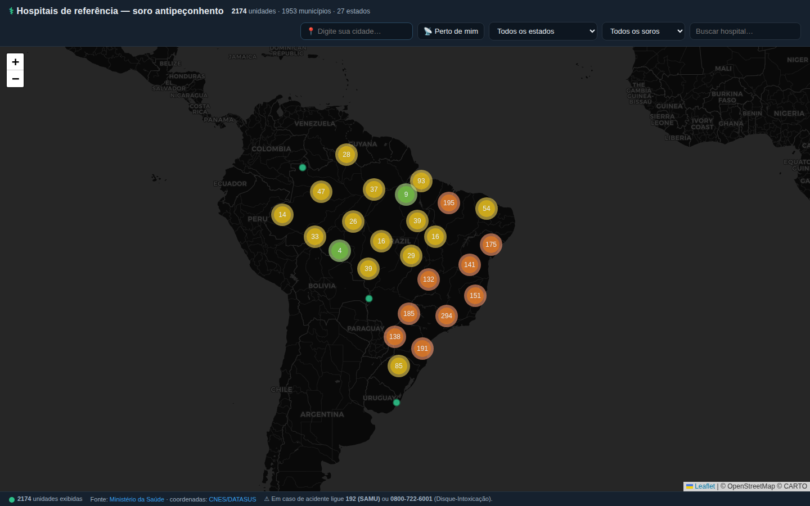

# 🐍 Hospitais com Soro Antipeçonhento no Brasil

Mapa interativo dos **hospitais de referência do SUS** para atendimento a acidentes
com animais peçonhentos (cobras, escorpiões, aranhas, lonomia etc.), onde há
**soro antiveneno** disponível.

**🗺️ Acesse o mapa:** https://lucashiago.github.io/hospitais-soro-peconhentos/



## O que é

Acidentes com animais peçonhentos são uma emergência médica. O soro antiveneno só é
aplicado em **unidades de referência** definidas pelo Ministério da Saúde. Este projeto
reúne essas unidades num único mapa pesquisável, com **2.174 unidades em 1.953
municípios dos 27 estados**, mostrando para cada uma:

- Nome da unidade e município
- Endereço, CEP e telefone
- **Soros disponíveis** (botrópico, crotálico, laquético, elapídico, loxoscélico,
  fonêutrico, escorpiônico, aracnídico, antilonômico)
- Código CNES (com link para a ficha no DATASUS)

**📍 Busca por proximidade:** digite a sua cidade (ou use "Perto de mim") e o mapa
lista os **hospitais mais próximos**, ordenados pela distância em km — inclusive
em municípios vizinhos/estados vizinhos. Combina com o filtro de soro (ex.: "o
hospital mais próximo que tem soro **anticrotálico**"). Também dá para compartilhar
um link direto: `?cidade=Manaus`.

Filtros por **estado**, por **tipo de soro** e busca por nome/município.

> ⚠️ **Em caso de acidente, não perca tempo:** ligue **192 (SAMU)** ou para o
> **Disque-Intoxicação 0800-722-6001**. Este mapa é informativo e pode conter
> imprecisões — sempre confirme a disponibilidade do soro por telefone antes de
> se deslocar.

## Fontes de dados

| Dado | Fonte |
|------|-------|
| Lista de hospitais de referência e soros disponíveis | [Ministério da Saúde — Hospitais de Referência](https://www.gov.br/saude/pt-br/assuntos/saude-de-a-a-z/a/animais-peconhentos/hospitais-de-referencia) (PDFs por estado) |
| Nome, endereço, telefone e **coordenadas** de cada unidade | [API de Dados Abertos do CNES/DATASUS](https://apidadosabertos.saude.gov.br/) |
| Nomes de municípios | [IBGE — Localidades](https://servicodados.ibge.gov.br/api/docs/localidades) |
| Centroide municipal (fallback de localização) | [municipios-brasileiros](https://github.com/kelvins/municipios-brasileiros) |

Dados coletados em **junho/2026**. Os PDFs do Ministério da Saúde são atualizados
periodicamente — veja `data/` para os arquivos brutos usados.

## Como foi construído (reprodutível)

```
scripts/
  download.sh   # baixa os 27 PDFs de hospitais de referência do gov.br
  parse.py      # extrai os códigos CNES + soros de cada PDF (Piauí via OCR visual)
  enrich.py     # consulta a API do CNES p/ nome, endereço, telefone e coordenadas
  build_cidades.py # gera cidades.json (todas as cidades do BR p/ a busca por proximidade)
hospitais.json  # dataset final consumido pelo mapa
cidades.json    # cidades do Brasil + coordenadas (busca "perto de mim")
index.html      # mapa Leaflet (sem build, estático)
```

1. **Download** dos 27 PDFs estaduais do portal gov.br/saude.
2. **Parsing** com `pdftotext -layout`: cada unidade é ancorada pelo seu código
   **CNES** (número de 7 dígitos), e os soros são associados pela proximidade no
   texto. O PDF do **Piauí** é apenas imagem (sem camada de texto), transcrito à parte.
3. **Enriquecimento** via API do CNES: para cada código obtemos razão social/nome
   fantasia, endereço, telefone e **latitude/longitude oficiais**. Quando a unidade
   não tem coordenada no CNES (~20 casos), usamos o **centroide do município**
   (marcado como 📍 *localização aproximada* no mapa).

### Rodar localmente

```bash
bash scripts/download.sh        # -> data/pdfs/*.pdf
python3 scripts/parse.py        # -> parsed.json
python3 scripts/enrich.py       # -> hospitais.json
python3 -m http.server 8000     # abra http://localhost:8000
```

Dependências: `poppler-utils` (`pdftotext`), Python 3, `curl`.

## Limitações conhecidas

- O mapa reflete os PDFs publicados pelo Ministério da Saúde na data da coleta;
  pode haver defasagem em relação à realidade local.
- ~9% das unidades não tiveram o tipo de soro extraído de forma confiável do PDF
  (o ponto aparece no mapa, sem a lista de soros).
- ~20 unidades sem coordenada no CNES são posicionadas no centro do município.
- Cerca de 19 códigos do PDF não foram encontrados na base do CNES e foram omitidos.

## Licença

Código sob licença [MIT](LICENSE). Os dados são públicos, de autoria do
Ministério da Saúde, IBGE e DATASUS.

---
🤖 Construído com [Claude Code](https://claude.com/claude-code).
